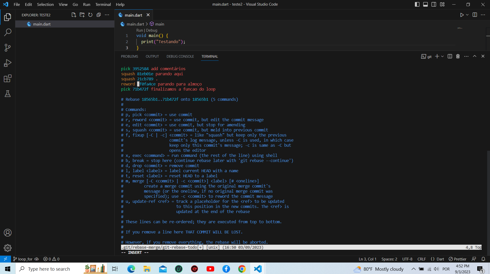

# Praticando O Rebase
Este projeto visa a prática dos comandos do git.

## Comandos do git mais usados no projeto

* git rebase
* squash
* reword
* git status
* git add .
* git commit -a -m 
* git merge
* git push

## Funções do gitHub  utilizadas no projeto

* issues
* project
* pull requests

### Imegam do rebase no git

### imagem da web.

### links

[Google](https://www.google.com/search?q=Google&gs_ivs=1)

[https://www.google.com/search?q=Google&gs_ivs=1](https://www.google.com/search?q=Google&gs_ivs=1)

